# plant-disease-nst
Autumn 2020 CS 229 project on Plant Disease Dataset Augmentation using Neural Style Transfer (NST).

Authors: Sharan Ramjee and Sofian Zalouk

## Paper Images

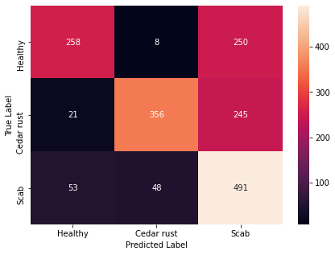

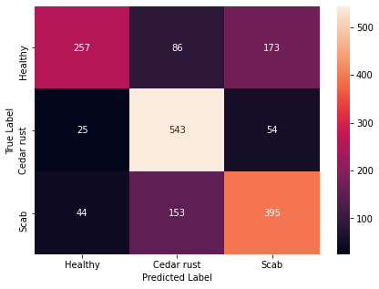

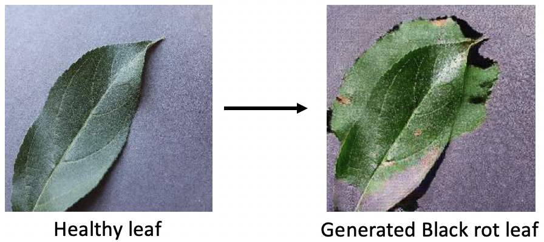

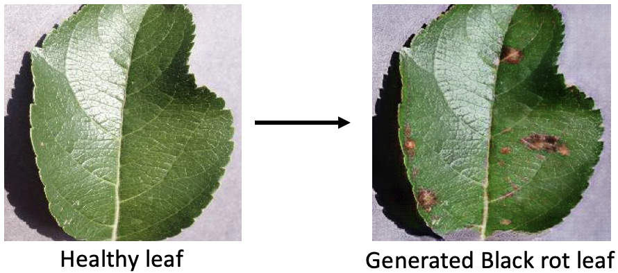

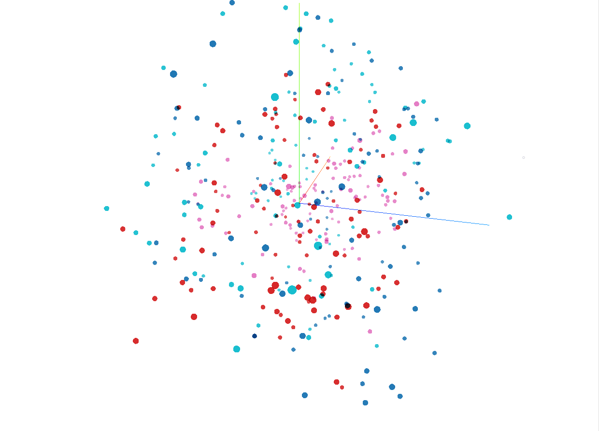

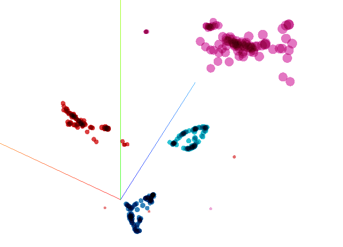

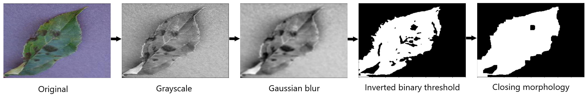

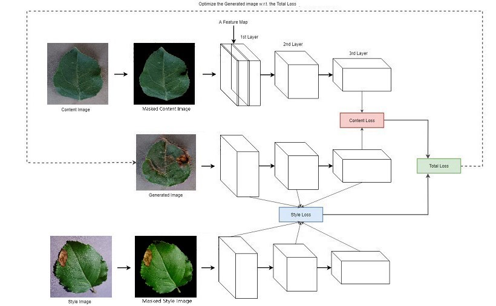

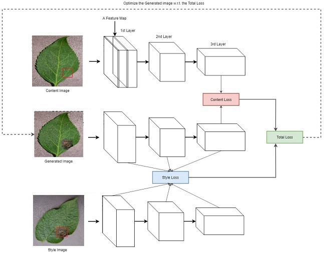

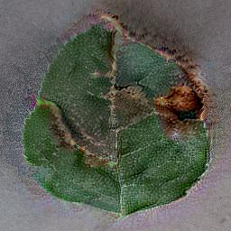

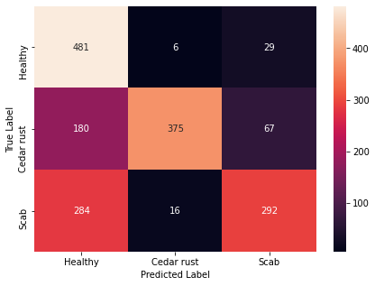

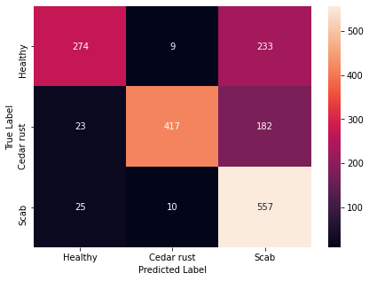

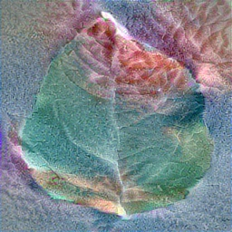

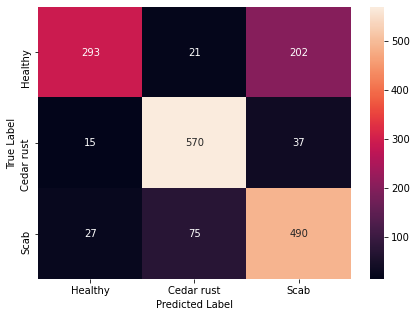

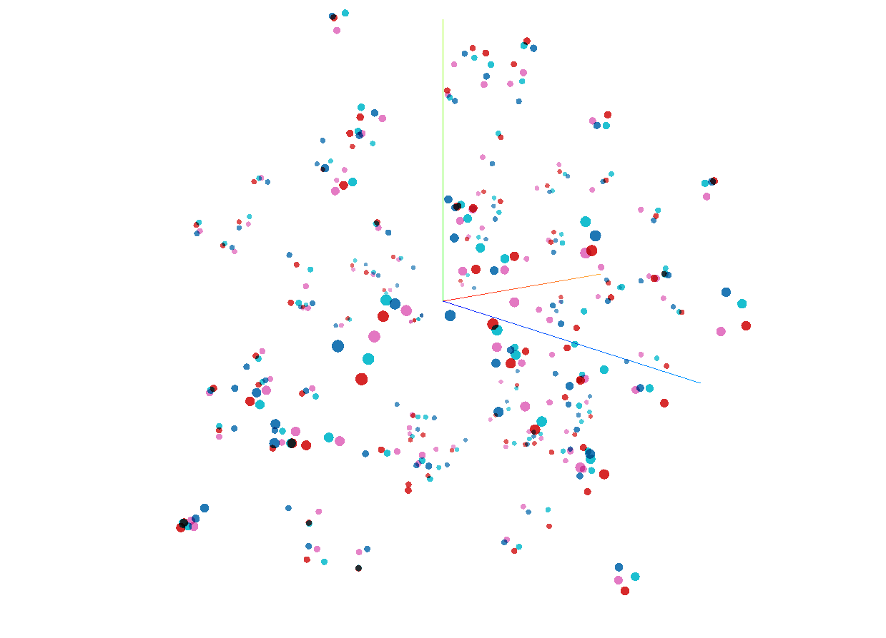

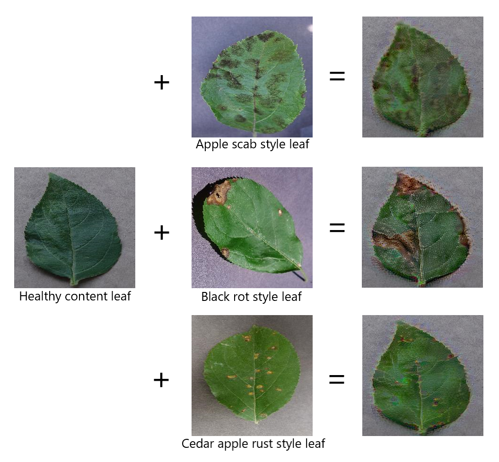

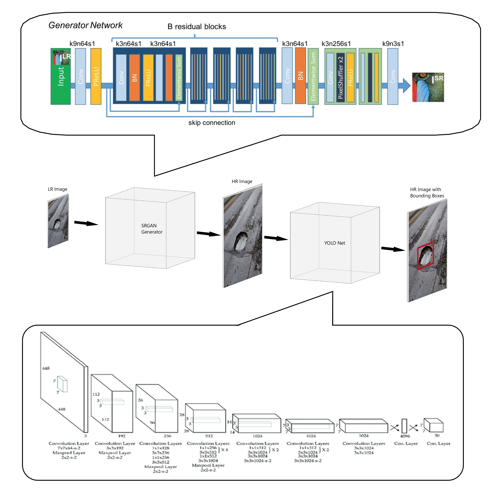

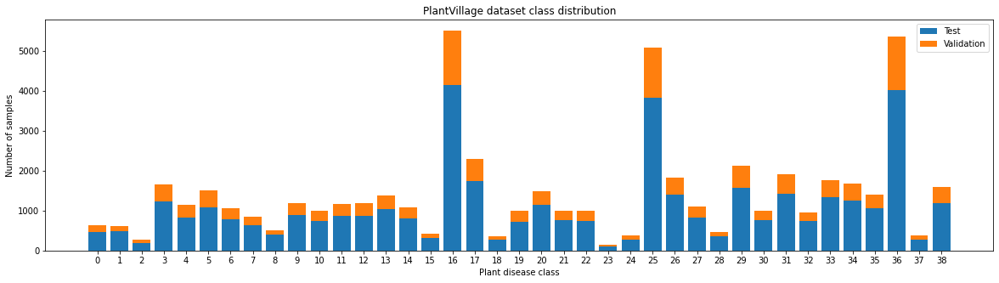
